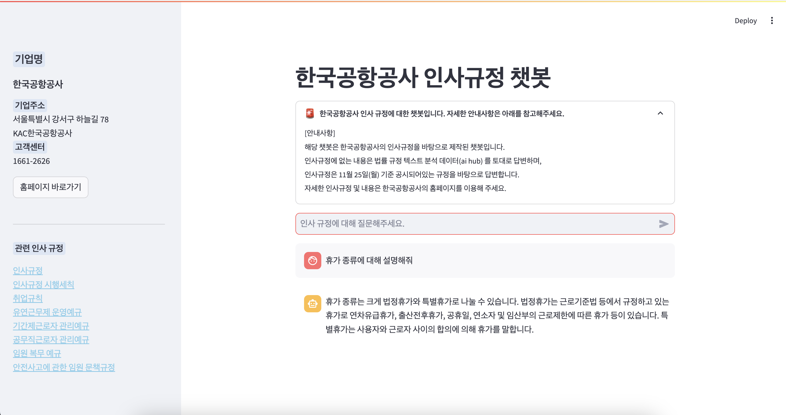

# SKN05-3RD-3TEAM

### 🤖 3차 프로젝트: LLM 기반 내외부 기반 질의응답 시스템  
**프로젝트명:** 법률 확인 챗봇 시스템  
**개발기간:** 2024.11.26 - 2024.11.27  

## 💻 팀 소개

**팀명:** 보람3조  

| **김요은👩‍💻** | **박찬규👨‍💻** | **김혜서👩‍💻** | **박보람👩‍💻** |
|:--------------:|:--------------:|:--------------:|:--------------:|
| @usey10        | @thanGyuPark   | @Hyeseo20      | @pbr2858        |

---

### 📌 1. 프로젝트 개요

#### 1.1. 개발 동기 및 목적  
현재 대부분의 챗봇은 고객 서비스를 위한 시스템이 주를 이루고 있습니다.  
본 프로젝트는 **기업의 원활한 업무 지원**을 목표로, **인사, 징계, 복무 규정**과 같은 기업의 중요한 법적 규정을 정확히 안내하는 **법률 확인 챗봇 시스템**을 구현하고자 했습니다.  
외부 데이터로는 **대한민국 헌법**과 **AI HUB의 법률/규정 텍스트**를 활용하여 법적 질의에 대한 정확한 답변을 제공하는 챗봇 시스템을 개발했습니다.  

#### 1.2. 필요성  
기존 챗봇 시스템은 특정 기업의 규정을 반영하지 못해, 일반적인 정보만을 제공하는 데 한계가 있습니다.  
특히 **공항과 같은 특수 시설**에서 적용되는 규정들은 정확하고 구체적인 정보 제공이 필요합니다.  
**인사, 복무, 징계** 규정은 직원들에게 중요한 정보를 제공하는 만큼, 이를 빠르고 정확하게 확인할 수 있는 시스템이 필요합니다.  
따라서, **내부 직원들이 자주 묻는 질문**에 즉시 답변할 수 있는 챗봇 시스템을 통해, **규정에 대한 접근성을 향상**시키고, 직원들의 이해를 돕고자 했습니다.

#### 1.3. 개발 목표  
- **특화된 정보 제공:** 공항 및 관련 기관의 규정과 절차 반영  
- **정확성 향상:** 일반적인 챗봇 한계를 넘는 **구체적이고 정확한 답변 제공**  
- **사용자 경험 개선:** 직관적이고 빠른 정보 제공을 위한 **UI/UX 최적화**  

---

### 📌 2. 기술 스택

#### 2.1. 프론트엔드

 

 

#### 2.2. 백엔드

 

 

---

### 📌 3. WBS (Work Breakdown Structure)

#### 3.1. 내부 데이터 수집 및 전처리
- **한국 공항 공사** 인사, 복무, 징계 규정 다운로드  
- 불필요한 HTML 태그, URL 제거  
- **RAG** 구현을 위한 데이터 형식 변경

#### 3.2. 외부 데이터 수집 및 전처리
- **AI HUB** 법률/규정 텍스트 다운로드  
- 불필요한 판결문 제거  
- 파인 튜닝을 위한 데이터 형식 변경

#### 3.3. API 사용하여 GPT 모델 파인 튜닝
- **토큰 수 계산 및 비용 산정**  
- **GPT 모델 선정** 및 결과 비교

#### 3.4. RAG 구현
- **파인 튜닝 모델 사용**  
- **답변 검증 및 비교**

#### 3.5. Streamlit 구현
- **UI/UX 최적화** 및 직관적인 화면 구현

---

### 📌 4. 모델 별 답변 비교 & 검증

#### 4.1. 모델 별 답변 비교 예시

| **질문**                          | **기본 GPT 모델**                         | **벡터 DB**                                 | **파인 튜닝**                                | **파인 튜닝   + 벡터 DB**                      | **규정 내용 확인**                         |
|-----------------------------------|----------------------------------------|-------------------------------------------|--------------------------------------------|--------------------------------------------|-------------------------------------------|
| **감봉 사유**                      | 직무 관련 의무 위반, 명령 불이행 등          | 감봉 사유를 구체적으로 나열                | 감봉 사유를 직무 관련으로 설명              | 다양한 사유를 상세히 나열                   | 문서 상에서 구체적 사유 제공              |
| **임신 관련된 휴가**                | 출산전후휴가, 유산휴가, 배우자 출산휴가 등    | 임신 관련된 휴가를 구체적으로 나열          | 임신 관련된 휴가를 직무 및 시술 기준으로 설명 | 임신 관련된 휴가와 상세 조건을 나열         | 규정에 명시된 휴가 조건 제공             |
| **근무형태 변경은 몇 번 까지 가능한가요?** | 일반적으로 1회 가능, 예외적으로 추가 변경 가능 | 근무형태 변경 규정이 명시되어 있지 않음, 여러 근무형태 정의 | 근무형태 변경 가능 횟수는 명시되지 않음 | 근무형태 변경이 여러 번 가능할 것이라 추측 | 1회 변경 가능, 예외적 상황에서 추가 변경 가능 |

---

### 📌 5. 답변 검증

#### 5.1. **감봉 사유**

| **공무직 근로자 관리 예규**              | **안전사고예방 근로자 문책규정**  | **인사 규정** |
|:--------------------------------------:|:-----------------------------:|:------------:|
| **징계의 종류** 파면, 해임, 정직, 감봉 등 명시 | **징계 종류 및 효과** 경고, 주의 등 명시 | **징계 사유** 직무 의무 위반 등 명시 |

#### 5.2. **임신 관련된 휴가**

| **공무직 근로자 관리 예규**        | **취업 규칙**                                         |
|:---------------------------------:|:---------------------------------------------------:|
| "제2장 인사 및 복무 제9조(복무) 공무직근로자의 근로시간, 휴일, 휴가, 휴직 등 복무에 관한 사항은 공사의 취업규칙, 인사규정 등 복무 관련규정에 따른다. <개정19.4.12>" | "제25조(특별휴가) ① 직원에게 경조사 또는 재해가 발생하였을 경우에는 '별표'에 따른 특별휴가를 부여한다. <개정 16.8.29> ... (기타 상세 내용 포함)" |

#### 5.3. **근무형태 변경은 몇 번 까지 가능한가요?**

| **공무직 근로자 관리 예규**        | **유연 근무제 운영예규**                              |
|:---------------------------------:|:--------------------------------------------------:|
| 변경에 대한 직접적인 내용은 없음 | "직접적인 내용은 없음 제3항에 따라 시간제 근무자로 전환된 사람은 전환 전의 신분을 유지함을 원칙으로 한다. 시간제 근무 기간은 1개월 이상으로 한다." |

---

### 📌 6. Streamlit 구현 결과
- 프로젝트의 주요 기능과 모델을 **Streamlit**을 통해 직관적인 사용자 인터페이스로 구현했습니다.  
  이를 통해 규정 관련 정보를 쉽게 확인할 수 있습니다.
  
  

---

### 📌 7. 한 줄 회고

• 김요은:  
• 박찬규:  
• 김혜서:  
• 박보람:  
